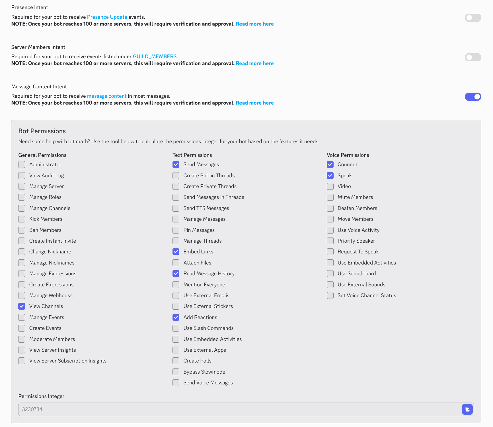

# librarian-bot
A simple Discord bot for book club.

## Setup

1. If you haven't already, install:
    - [git](https://git-scm.com/)
    - [Node.js](https://nodejs.org/en/) and [npm](https://www.npmjs.com/)
        - You likely want to install a Node.js version manager like [NVM](https://github.com/nvm-sh/nvm?tab=readme-ov-file#installing-and-updating) or [nvm-windows](https://learn.microsoft.com/en-us/windows/dev-environment/javascript/nodejs-on-windows)
    - [g++](https://gcc.gnu.org/onlinedocs/gcc-3.3.6/gcc/G_002b_002b-and-GCC.html) (GCC with C++ support) using your preferred package and/or version manager(s)
        - For a Linux-based OS, this is likely best achieved with the `build-essentials` package
        - For a Windows-based OS, install Visual Studio Community Edition with the "Desktop development with C++" module
2. Follow a tutorial ilke [this one](https://github.com/reactiflux/discord-irc/wiki/Creating-a-discord-bot-&-getting-a-token) to create a Discord "application" and a corresponding bot, generate a secret token for it (used below), and add it to your server
    - Below is a screenshot of the current recommended intents (Message Content) and permissions (`3230784`):
      
3. `git clone https://github.com/Brinsky/librarian-bot`
4. `cd librarian-bot`
5. `cp data/config-sample.json data/config.json` and `cp data/soundboard-sample.json data/soundboard.json`
    - Note that the sample soundboard config points to a non-existent / non-included WAV file, which you may wish to delete
6. Edit `data/config.json` and set the `token` property to your bot's token
7. `npm install`
8. `npx tsc` (compile the TypeScript source code)
9. Start the server: `node build/index.js`
    - You may prefer to run this in a detached session using e.g. [`screen`](https://www.gnu.org/software/screen/) or [`tmux`](https://github.com/tmux/tmux/wiki)
